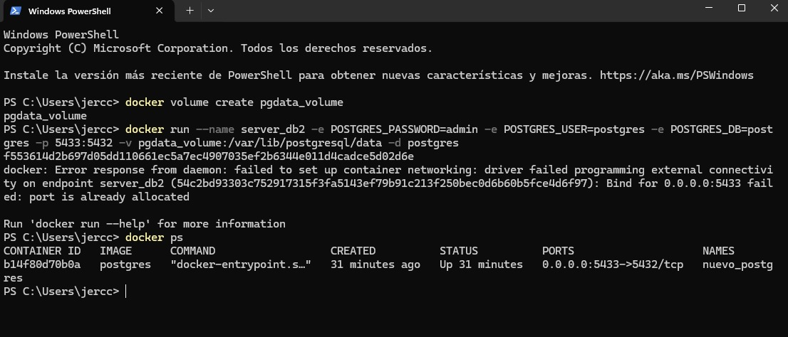

# Creacion volúmenes para persistir base de datos

## 1. Titulo
TAS3 - Volúmenes para persistir base de datos
## 2. Tiempo de duración
El tiempo de duración fue de 4 horas aproximadamente para el desarrollo de la práctica.

## 3. Fundamentos:

En esta...... práctica es primordial comprender estos conceptos: Docker, PostgreSQL y volúmenes.
Docker es una plataforma que permite crear contenedores donde se puede ejecutar software de forma reproducible. En cada contenedor se incluye todo lo necesario para que la aplicación funcione como un sistema de archivos,o bibliotecas, configuraciones, etc. Sin embargo, cuando un contenedor se elimina, los datos almacenados dentro de él también desaparecen, a menos que se utilicen mecanismos de persistencia como los volúmenes.

PostgreSQL es un sistema de gestión de bases de datos relacional (RDBMS), utilizado por su robustez, escalabilidad y compatibilidad con estándares SQL. En esta práctica, se usó PostgreSQL dentro de un contenedor Docker para demostrar cómo se comportan los datos cuando se usa o no un volumen.

Los volúmenes en Docker permiten almacenar datos fuera del ciclo de vida del contenedor, esto quiere decir que aunque se detenga o se elimine el contenedor, los datos guardados en el volumen se conservan. Esto nos garantiza que la información no se pierda entre reinicios o actualizaciones de contenedores.

Esta práctica tiene dos enfoques:
- Sin volumen: se creó un contenedor PostgreSQL, se ingresan datos y luego se eliminan. Al volver a crearlos, los datos se pierden.

- Con volumen: se crea otro contenedor PostgreSQL con un volumen asociado. Se eliminará y al volver a crear el contenedor, los datos deben seguir disponibles.

A su vez, se utilizó TabletPlus como administrador visual para conectarse a la base de datos PostgreSQL, facilitando la creación de tablas y el manejo de registros sin necesidad de usar directamente la terminal.

## 4. Conocimientos previos.

Para realizar esta practica el estudiante necesita tener claro los siguientes temas:
- Uso de la terminal o línea de comandos
- Manejo de navegador
- Uso de Docker
- Fundamentos de bases de datos relacionales
- TablePlus o DataGrip

## 5. Objetivos a alcanzar

- Comprender la necesidad de persistencia en aplicaciones basadas en contenedores.
- Crear y gestionar volúmenes persistentes usando comandos de Docker.
- Identificar la diferencia entre ejecutar un contenedor con o sin volumen.

## 6. Equipo necesario:

- Computador con sistema operativo Windows/Linux/Mac 
- Cuenta en docker play
- Docker y terminal
- TablePlus instalado

## 7. Material de apoyo.

- Documentacion oficial de docker.
- Guia de la asignatura.
- Cheat sheet de comandos linux
- Documentación de TablePlus

## 8. Procedimiento

## Parte 1: Base de datos sin volumen

### Paso 1:Crear un contenedor PostgreSQL con el nombre server_db1.
Dentro de la terminal con el contenedor se ejecuta este comando: docker run --name server_db1 -e POSTGRES_PASSWORD=1234 -p 5432:5432 -d postgres. De esta manera se crea y se ejecuta un contenedor PostgreSQL con su puerto.

### Paso 2: Conectar un administrador de base de datos (como DataGrip o TablePlus) al contenedor server_db1.
Se conecto con un administrador de base de datos, en este caso se utilizo TablePlus para poder conectar con server_db1. Se uso localhost como host, puerto 5432, usuario postgres, y contraseña 1234.

### Paso 3: Crear una base de datos llamada test.
Se crea una base de datos llamado test.

### Paso 4: En la base de datos test, crear una tabla llamada customer con los campos: id, fullname y status.
Se crea la tabla customer dentro de test. Se utilizo id, fullname y status.

### Paso 5: Insertar al menos un registro en la tabla customer
Insertar dos registro en la tabla.

### Paso 6: Detener y eliminar el contenedor server_db1.
- El primer comando->  docker stop server_db1  ->detiene el contenedor.
- El segundo comando->  docker rm server_db1 ->elimina el contenedor detenido.

Verifico las veces necesarias hasta que el contenedor si a sido eliminado, con este comando: docker ps -a  y para isnpeccionar con: docker volumen ls 

### Paso 7: Volver a crear el contenedor PostgreSQL con el mismo nombre server_db1.
Se vuelve a crear el contenedor con el mismo nombre server_db1: docker run --name server_db1 -e POSTGRES_PASSWORD=1234 -p 5432:5432 -d postgres
Verifico que el contenedor este corriendo con este comando: docker ps

### Paso 8: Conectarse nuevamente desde el administrador de base de datos.
Se volvio a conectarse nuevamente desde TablePlus.

### Paso 9: Verificar que la base de datos test ya no existe, demostrando que los datos no se han conservado.
Se verifico la base de datos de test ya no exista.

## Parte 2: Base de datos con volumen

### Paso 1:Crear un volumen en Docker con el comando:
Crear un volumen en Docker:docker volume create pgdata

### Paso 2: Crear un contenedor PostgreSQL con el nombre server_db2, asociando el volumen creado:
Se crea un contenedro PostgreSQL con volumen: docker run --Ale server_db2 -e POSTGRES_PASSWORD=1234 -p 5433:5432 -v pgdata:/var/lib/postgresql/data -d postgres

Verifico que el contenedor esté corriendo

### Paso 3: Conectarse al contenedor con DataGrip o TablePlus.
Se conecto desde TablePlus a server_db2, usando:  localhost, puerto 5433, usuario postgres, contraseña 1234.

### Paso 4: Crear la base de datos test.
Se crea la base de datos test.

### Paso 5: Crear la tabla customer con los campos: id, fullname, status.
Se crea la base de datos customer con sus respectivos campos.

### Paso 6: Insertar al menos un registro en la tabla.
Se inserto dos registros.

### Paso 7: Detener y eliminar el contenedor server_db2.
.......

### Paso 8: Volver a crear el contenedor server_db2 usando el volumen pgdata nuevamente.
Volver a crear el contenedor usando el volumen pgdata

### Paso 9: Conectarse desde el administrador de base de datos y verificar que la base de datos test y los registros han persistido.
Se conecta desde TablePlus y verificar que los datos sigan.

## 9. Resultados esperados:

- Los resultados obtenidos es que sin volumen, la base de datos y sus registros se pierden al eliminar el contenedor.
- Con volumen, los datos permanecen incluso al eliminar y volver a crear el contenedor.
- Se visualiza correctamente la información desde TablePlus.
- Se refuerzan los conocimientos sobre persistencia de datos en contenedores Docker.

## 10. Bibliografía

- Docker Inc. (2024). Docker Documentation. Recuperado de: https://docs.docker.com

- TablePlus. (2024). Documentación oficial. TablePlus. https://tableplus.com

- PostgreSQL Global Development Group. (2024). PostgreSQL: The world's most advanced open source relational database. https://www.postgresql.org

- Docker Inc. (2024). Docker volumes. Recuperado de https://docs.docker.com/storage/volumes/

