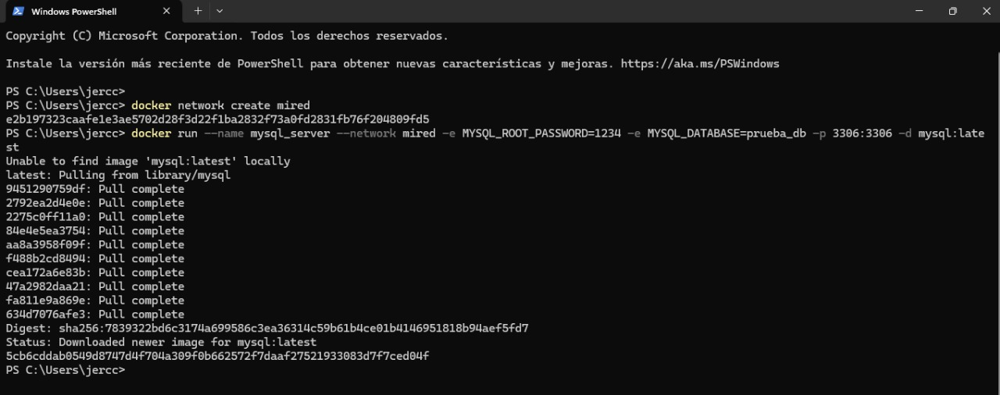

# TENDENCIAS TECNOLOGICAS

## 1. Titulo
TAS4 - Red de contenedores mysql y phpmyadmin
## 2. Tiempo de duración
El tiempo de duración fue de 5 horas aproximadamente para el desarrollo de la práctica.

## 3. Fundamentos:

En esta práctica se trabajó con contenedores Docker, comprendiendo conceptos fundamentales de redes como:

Dirección IP: Identificador único para la comunicación entre dispositivos o contenedores en una red.
Puerto: Punto de acceso para diferenciar múltiples servicios en un mismo contenedor o máquina.
Red personalizada en Docker: Permite la comunicación controlada y segura entre contenedores.

MySQL es un sistema de gestión de bases de datos relacional (RDBMS), ampliamente utilizado para almacenar y administrar información estructurada. En esta práctica, se utiliza MySQL dentro de un contenedor Docker para gestionar bases de datos de prueba.

phpMyAdmin es una herramienta basada en web que permite la administración de bases de datos MySQL a través de una interfaz gráfica amigable, facilitando la creación, modificación y eliminación de bases de datos y registros.

Esta práctica tiene dos enfoques:
- Crear una red personalizada en Docker para permitir la comunicación entre contenedores.

- Implementar y conectar dos servicios (MySQL y phpMyAdmin) utilizando dicha red

Además, se utilizó MySQL que es un sistema de gestión de bases de datos relacional y phpMyAdmin que es una herramienta web para administrar bases de datos MySQL de forma gráfica.

El objetivo es crear una red personalizada en Docker para interconectar dos contenedores: uno ejecutando MySQL y otro phpMyAdmin.

## 4. Conocimientos previos.

Para realizar esta practica el estudiante necesita tener claro los siguientes temas:
- Uso de la terminal o línea de comandos
- Manejo de navegador
- Uso básico de Docker
- Conceptos de redes en Docker
- Manejo básico de bases de datos MySQL
- Uso de phpMyAdmin
Ademas:
- Comandos para crear redes.
- Unir contendores a una red
- Configurar aplicaciones

## 5. Objetivos a alcanzar

- Implementar redes de contenedores en Docker para permitir la       comunicación entre aplicaciones contenerizadas.
- Comprender los diferentes tipos de redes disponibles.
- Crear dos contenedores, uno para MySQL y otro para phpMyAdmin, establecer una red personalizada en Docker que permita la comunicación entre ambos, 
- Crear una base de datos de prueba usando la interfaz de phpMyAdmin.

## 6. Equipo necesario:

- Computador con sistema operativo Windows/Linux/Mac 
- Cuenta en docker play
- Docker y terminal
- Uso de phpMyAdmin

## 7. Material de apoyo.

- Documentacion oficial de docker.
- Documentación oficial de MySQL.
- Documentación oficial de phpMyAdmin.
- Guia de la asignatura.

## 8. Procedimiento

## Parte 1: Crear dos contenedores: uno para MySQL y otro para phpMyAdmin, y establecer una red que permita la comunicación entre ambos.

### Paso 1:Crear un contenedor para MySQL, definiendo las credenciales necesarias.
Luego crear una red personalizada llamada mired para permitir la comunicación entre los contenedores: 

- docker network create mired

Crear el contenedor de MySQL, especificando la contraseña del usuario root y una base de datos de prueba: docker run --name mysql_server --network mired -e MYSQL_ROOT_PASSWORD=1234 -e MYSQL_DATABASE=prueba_db -p 3306:3306 -d mysql:latest
Tomemos en cuenta que:
- --name mysql_server: le pone de nombre mysql_server al contenedor.
- --network mired: conecta este contenedor a la red que se creo.
- -e MYSQL_ROOT_PASSWORD=1234: establece que la contraseña de root será 1234.
- -e MYSQL_DATABASE=prueba_db: crea una base de datos llamada prueba_db.
- -p 3306:3306: expone el puerto de MySQL para que se pueda usarlo.
- -d mysql:latest: usa la última versión de MySQL.

### Paso 2: Crear un contenedor para phpMyAdmin, configurando las credenciales.

Crear el contenedor para phpMyAdmin: 
docker run --name phpmyadmin_server --network mired -e PMA_HOST=mysql_server -p 8080:80 -d phpmyadmin/phpmyadmin
Tomemos en cuenta que:
- --name phpmyadmin_server: nombra al contenedor phpmyadmin_server.
- --network mired: lo conecta a la red mired.
- -e PMA_HOST=mysql_server: dice que el servidor de base de datos es el contenedor mysql_server.
- -p 8080:80: hace que phpMyAdmin esté accesible en el navegador entrando a localhost:8080.

### Paso 3: Crear una red personalizada en Docker que permita la comunicación entre ambos contenedores.

Crear el contenedor de phpMyAdmin y conectarlo a la misma red, indicando el servidor de MySQL: docker run --name phpmyadmin_server --network mired -e PMA_HOST=mysql_server -p 8080:80 -d phpmyadmin/phpmyadmin
Tomemos en cuenta que:
- PMA_HOST=mysql_server establece el contenedor de MySQL como host.
- -p 8080:80 expone phpMyAdmin en el puerto 8080 de la máquina local.

### Paso 4: Conectar ambos contenedores a la red creada.

Al crear los contenedores usando el parámetro --network mired, ambos ya están conectados automáticamente a la misma red. Esto permite visualizar los detalles de la red mired.

### Paso 5: Configurar la conexión entre phpMyAdmin y MySQL, y crear una base de datos de prueba desde la interfaz de phpMyAdmin.

Abrir un navegador web y acceder a http://localhost:8080.
En la pantalla de inicio de phpMyAdmin, conectarse usando:
- Servidor: mysql_server
- Usuario: root
- Contraseña: 1234
Una vez dentro de phpMyAdmin, verificar que prueba_db se haya creado correctamente.
Crear una tabla de prueba para confirmar que la conexión entre phpMyAdmin y MySQL funciona correctamente.

## 9. Resultados esperados:

- Contenedores conectados correctamente mediante la red personalizada mired.
- Acceso exitoso a MySQL mediante phpMyAdmin usando la IP de red interna.
- Creación de bases de datos y tablas usando phpMyAdmin.
- Se fortalecen los conocimientos en creación de redes, administración de contenedores y gestión básica de bases de datos.

## 10. Bibliografía

- Docker Inc. (2024). Docker Documentation. Recuperado de: https://docs.docker.com

- MySQL Documentation Team. (2024). MySQL 8.0 Reference Manual. Recuperado de: https://dev.mysql.com/doc/

- phpMyAdmin. (2024). phpMyAdmin Documentation. Recuperado de: https://docs.phpmyadmin.net/ 

- Nickoloff, J., & Kuenzli, S. (2019). Docker in Action. Simon and Schuster.

- Miell, I., & Sayers, A. (2019). Docker in Practice. Simon and Schuster.

